<div align="center">



<br/>
<br/>

<a href="https://github.com/la777am">

</a>

<br/>

<a href="mailto:ayushmali1904@gmail.com">

</a>
<a href="https://linkedin.com/in/ayushmali">

</a>


</div>

---

### `>_whoami`

B.E. Computer Science Engineering student building production-grade systems across **AI/ML**, **backend engineering**, and **full-stack development**. Focused on writing clean, scalable code that solves real problems.

```
Education      B.E. in Computer Science & Engineering
Focus          Data Structures · Backend Development · System Design
Learning       Machine Learning · Deep Learning · Orbital Dynamics
```

---

### `>_ls top_projects/`

| | Project | What It Does |
|---|---------|-------------|
| 🛰️ | **PANAMÆRA** | Real-time orbital debris avoidance with SGP4 mechanics and 3D visualization |
| 🧬 | **GenoScope** | DNA sequence analysis, predictive modeling, and genomic profiling |
| 📡 | **OmniParse AI** | Document intelligence platform with RAG-based semantic retrieval |
| ⚙️ | **FinOps Guardian** | Cloud cost forecasting engine across AWS, Azure, and GCP |

---

### `>_cat tech_stack.yml`

<div align="center">

**Languages**  
 <br/>
`Python` · `Java` · `JavaScript` · `SQL`

<br/>

**Frontend**  
 <br/>
`React.js` · `Next.js` · `Three.js` · `Tailwind CSS`

<br/>

**Backend**  
 <br/>
`FastAPI` · `Django` · `Flask` · `Express.js` · `Node.js`

<br/>

**Databases**  
 <br/>
`PostgreSQL` · `MongoDB` · `MySQL` · `Redis`

<br/>

**AI / ML**  
 <br/>
`PyTorch` · `Scikit-learn` · `Pandas` · `NumPy` · `LightGBM`

<br/>

**DevOps & Tools**  
 <br/>
`Docker` · `Git` · `Linux` · `GitHub Actions`

</div>

---

### `>_neofetch github_stats`

<p align="center">
  
  
</p>

---


<div align="center">
<h3><code>>_git log --graph</code></h3>
</div>

<p align="center">
  <picture>
    <source media="(prefers-color-scheme: dark)" srcset="https://raw.githubusercontent.com/la777am/la777am/output/github-contribution-grid-snake-dark.svg">
    <source media="(prefers-color-scheme: light)" srcset="https://raw.githubusercontent.com/la777am/la777am/output/github-contribution-grid-snake.svg">
    
  </picture>
</p>

<br/>

<div align="center">

</div>
